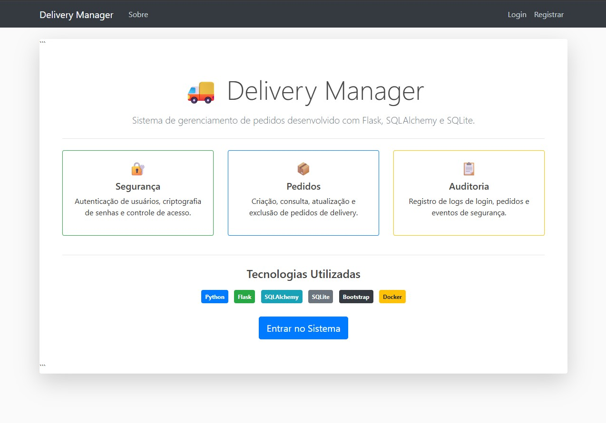

# Delivery Manager using Flask



Sistema web de gerenciamento de pedidos de delivery desenvolvido com Python, Flask, SQLAlchemy e SQLite como parte de um estudo de caso sobre SDLC, DevOps e DevSecOps.

## Descrição

A aplicação permite que usuários autenticados realizem o gerenciamento completo de pedidos de delivery, incluindo criação, consulta, atualização e exclusão de pedidos. O sistema também registra eventos de autenticação e operações realizadas pelos usuários, permitindo auditoria e monitoramento das atividades.

O projeto foi desenvolvido a partir da adaptação de um sistema de gerenciamento de tarefas para um sistema de pedidos de delivery, incorporando práticas de segurança, conteinerização com Docker e preparação para pipelines CI/CD.

---

## Funcionalidades

### 🔐 Autenticação e Controle de Acesso

- Cadastro de usuários
- Login e logout
- Alteração de senha
- Senhas armazenadas utilizando hash BCrypt
- Acesso restrito a usuários autenticados

### 📦 Gerenciamento de Pedidos

- Criar pedidos
- Visualizar pedidos
- Atualizar pedidos
- Excluir pedidos
- Controle de propriedade dos pedidos por usuário

### 📋 Auditoria e Logs

- Registro de login bem-sucedido
- Registro de falhas de autenticação
- Registro de criação de pedidos
- Registro de atualização de pedidos
- Registro de exclusão de pedidos
- Registro de eventos de segurança

---

## Tecnologias Utilizadas

### Back-end

- Python
- Flask
- SQLAlchemy
- Flask-Login
- Flask-WTF
- SQLite
- BCrypt

### Front-end

- HTML
- CSS
- Bootstrap
- JavaScript

### DevOps e Segurança

- Docker
- Git
- GitHub
- GitHub Actions (CI/CD)
- Bandit (SAST)
- OWASP Dependency Check
- OWASP ZAP (DAST)

---

## Estrutura do Projeto

```text
todo_project/
│
├── Dockerfile
├── requirements.txt
├── run.py
├── reset_db.py
│
└── todo_project/
    ├── __init__.py
    ├── forms.py
    ├── models.py
    ├── routes.py
    ├── static/
    └── templates/
````

---

## Instalação Local

Clone o repositório:

```bash
git clone https://github.com/gabrielesequeira/delivery-system-devsecops.git
```

Acesse a pasta do projeto:

```bash
cd delivery-system-devsecops/todo_project
```

Crie um ambiente virtual:

```bash
python -m venv venv
```

Ative o ambiente virtual:

### Windows

```bash
venv\Scripts\activate
```

### Linux/Mac

```bash
source venv/bin/activate
```

Instale as dependências:

```bash
pip install -r requirements.txt
```

Execute a aplicação:

```bash
python run.py
```

A aplicação estará disponível em:

```text
http://localhost:5000
```

---

## Execução com Docker

Construir a imagem:

```bash
docker build -t delivery-manager .
```

Executar o container:

```bash
docker run -p 5000:5000 delivery-manager
```

A aplicação estará acessível em:

```text
http://localhost:5000
```

---

## Segurança Implementada

* Autenticação obrigatória antes de qualquer ação
* Senhas protegidas com BCrypt
* Controle de autorização por usuário
* Registro de eventos em logs
* Preparação para análise estática (SAST)
* Preparação para análise dinâmica (DAST)
* Compatibilidade com práticas DevSecOps

---

## Fluxo Simplificado da Aplicação

```text
Usuário
   ↓
Frontend (HTML/CSS/Bootstrap)
   ↓
Flask
   ↓
SQLAlchemy
   ↓
SQLite
   ↓
Logs de Auditoria
```

---

## Objetivo Acadêmico

Este projeto foi desenvolvido para aplicação prática dos conceitos de:

* Software Development Life Cycle (SDLC)
* DevOps
* DevSecOps
* Docker
* Integração Contínua (CI)
* Entrega Contínua (CD)
* Segurança de Aplicações Web

---

## Autor

**Gabriele Sequeira**

```

